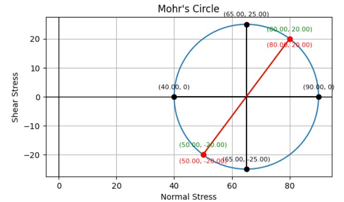
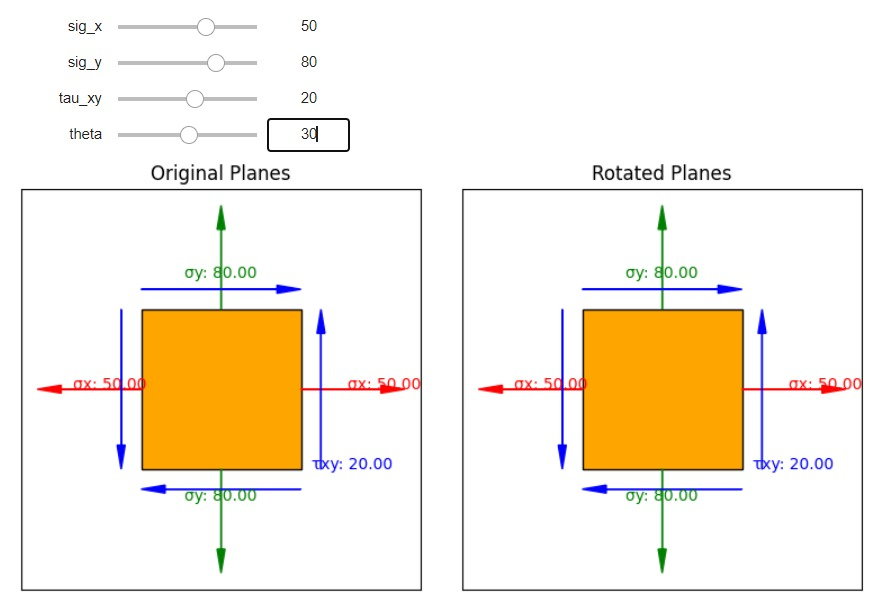
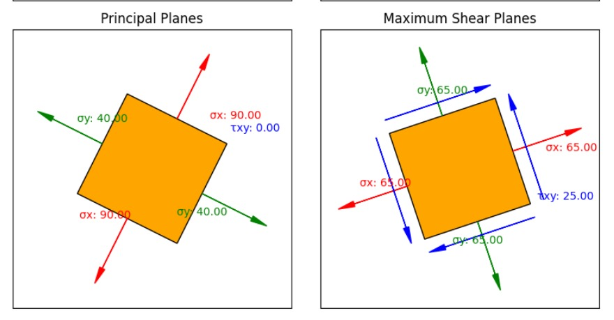

# Mohr Circle Simulator

## Overview
This is a simulator used to plot stress and strain on a finite element. You can use the sliders to manipulate stress components and observe changes in the Mohr Circle representation.

## How to Use
1. Clone or download the repository to your local machine.
2. Run all the cells of the notebook
3. Adjust the sliders to modify stress components and observe changes in the Mohr Circle plot.

## Features
- Interactive sliders for modifying stress components.
- Real-time updates of the Mohr Circle representation.
- Capability to include images for additional visual context.

## Preview

